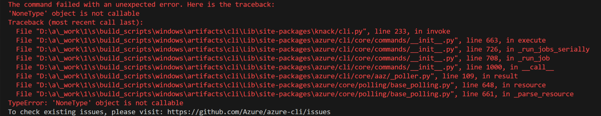

## Why drop autorest framework in AAZ-Dev Tool?

1. It helps to generate Atomic Commands without relies on SDKs. Atomic commands can help to reduce the package size and save the efforts to bump up SDKs.
2. AAZ-Dev separates the generation in two steps: 1. swagger to command model. 2. command model to code. It's more flexible than Autorest which generates code directly from swagger. With this flexibility, we implement multi api versions and multi profiles support.
3. Autorest uses configuration files to support modifications. However, it's hard to learn and not easy to use for beginners. AAZDev tool use declarative command model, the modification of it is state-of-truth, and we provide an easy-to-use portal for users.

## Does AAZDev support data-plane APIs?

Yes. We have data-plane supported.

## Filename too long in Git for Windows

The path of configuration files in aaz repo will have more than 260 characters. It will cause a `Filename too long` issue while using `git`.
Please enable the `core.longpaths` module by the following command in terminal which is in `Run as administrator` mode.
```bash
git config --system core.longpaths true
```

## Why the tests for my generated cmds reports "The swagger file does not define '202' response code" error?

According to [azure rpc protocol](https://github.com/Azure/azure-resource-manager-rpc/blob/master/v1.0/async-api-reference.md#202-accepted-and-location-headers), if the operation is `x-ms-long-running-operation`, 202 response status should be defined in swagger file. Therefore, either change the operation not `x-ms-long-running-operation`, or add 202 response in swagger for this operation.

## Why does Long-Running Operation fail to deserialize the final response?

The definition of [200/201 Responses](https://github.com/Azure/azure-rest-api-specs/blob/main/documentation/openapi-authoring-automated-guidelines.md#r2064-lrostatuscodesreturntypeschema) is missing in the Swagger Specification. For more design considerations about LRO, please refer to [Considerations for Service Design](https://github.com/microsoft/api-guidelines/blob/vNext/azure/ConsiderationsForServiceDesign.md#long-running-operations).

## Why my codegen V2 generated cmds' help message not inherited from my "summary" message from its swagger file?

Codegen v2 uses "description" of swagger definition for cmd's 'help' message, not 'summary'

## Long running operation(LRO) command execute failed with error: 'None' type object is not callable.



This issue is caused by the miss match between Swagger(OpenAPI Spec) definition and LRO behavior. It seems the final response body from LRO is not empty, but the `x-ms-long-running-operation-options.final-state-schema` field in swagger is not defined. You can reference this swagger doc https://github.com/Azure/autorest/tree/main/docs/extensions#x-ms-long-running-operation-options For details. BTW, when you run the cli command, you can add `--debug` argument to display the request logs.

## Does AAZDev support pagination?
Yes, codegen naturally supports pagination when there is `x-ms-pageable` defined in swagger, e.g., https://learn.microsoft.com/en-us/cli/azure/network?view=azure-cli-latest#az-network-list-usages-optional-parameters.
